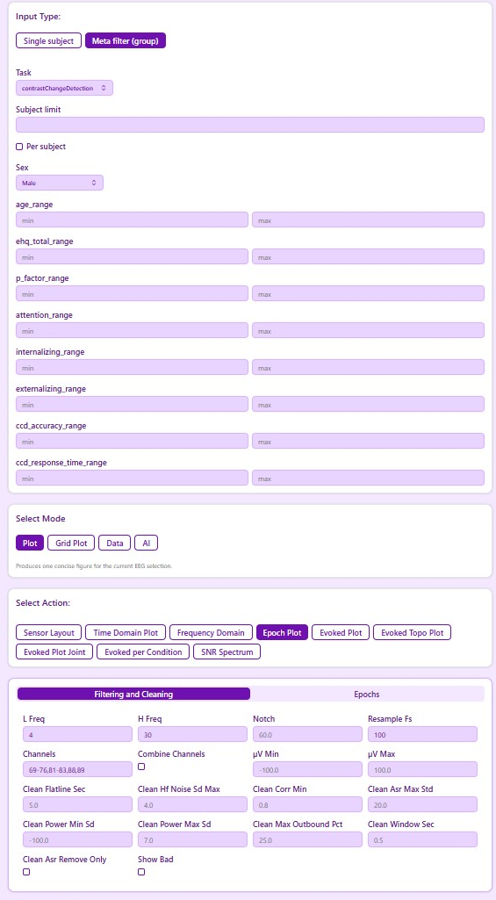
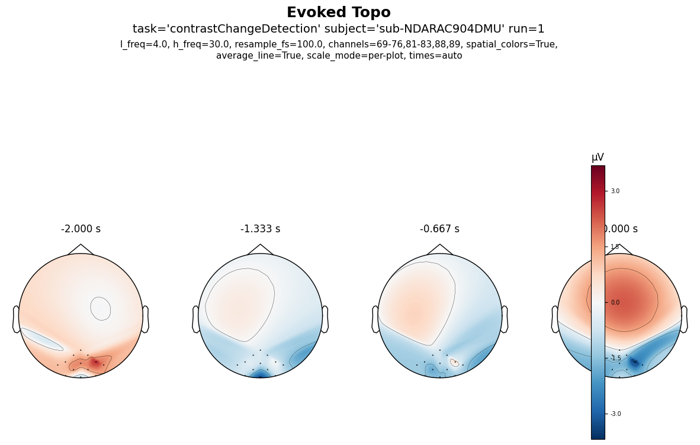
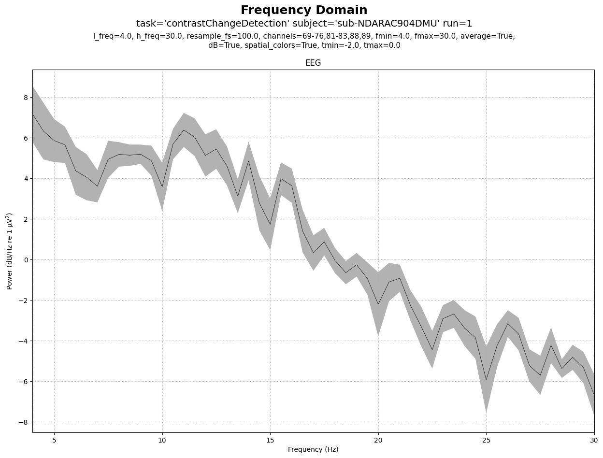
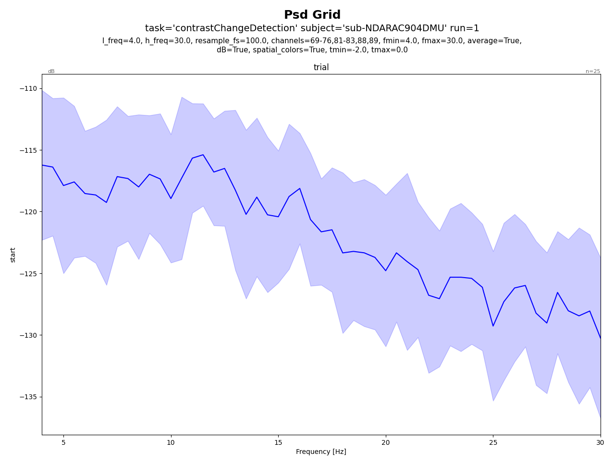
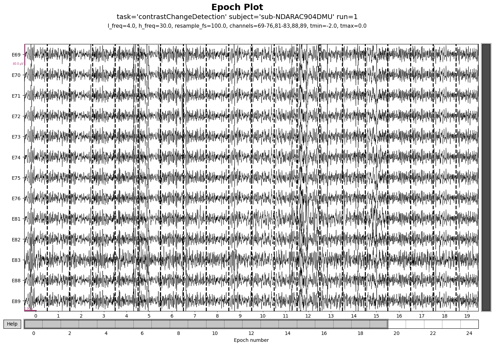

<!-- Title bar -->

  

    <h1>EEG Analysis Platform for Predicting Behavior from Brain Activity</h1>
    
<strong>Nantawat Suksirisunt &nbsp;·&nbsp; Naytitorn Chaovirachot</strong>

    
Kasetsart University &nbsp;·&nbsp; Department of Computer Engineering &nbsp;·&nbsp; In collaboration with BRAIN-Interfaces Lab, VISTEC

  

  

    <strong>KU Advisor</strong> 
    Asst. Prof. Dr. Thanawin Rakthanmanon 
    <em style="font-size:15px">Kasetsart University</em> 
     
    <strong>VISTEC Advisor</strong> 
    Assoc. Prof. Dr. Theerawit Wilaiprasitporn 
    <em style="font-size:15px">BRAIN-Interfaces Lab, VISTEC</em> 
     
    <strong>Academic Year:</strong> 2567
  

<!-- Row 1 — Project Overview | Objectives -->

  

    <h2>Project Overview</h2>
    
<strong>What is EEG?</strong> EEG measures electrical signals from the brain using sensors on the scalp. Brain signals can reveal what a person is thinking or about to do, even before they act.

    
<strong>The Challenge:</strong> Scientists want to use brain signals to predict behavior (e.g., will this decision be correct? how fast will someone react?). But today, they must glue together different tools that don't communicate well, leading to errors and wasted time.

    
<strong>Our Solution:</strong> We built a single platform that handles the entire workflow — from raw brain recordings to predictions. Everything is connected, documented, and repeatable, so scientists can focus on discoveries instead of fixing broken pipelines.

  

  

    <h2>Objectives</h2>
    <ul>
      <li>Build a systematic, reproducible EEG analysis platform usable by domain researchers without deep engineering expertise.</li>
      <li>Evaluate whether <strong>brain signals before a task</strong> can predict: 
        &nbsp;&nbsp;① Whether the trial was correct 
        &nbsp;&nbsp;② How fast the person reacted
      </li>
      <li>Provide transparent experiment tracking so results can be replicated and extended.</li>
    </ul>
  

<!-- Row 2 — Platform & UI (tall, software emphasis) -->

  

    <h2>Platform &amp; Visualization</h2>
    
The platform exposes a modal workflow — users select a <em>mode</em> (e.g. Preprocess, Epoch, Analysis) then configure and execute actions via a clean web interface. All outputs are cached and parameterised for full reproducibility.

    

      <!-- Left: main UI screenshots -->
      

        
        
      

      <!-- Right: 2×2 plot grid -->
      

        <figure>
          
          <figcaption>Evoked Topography</figcaption>
        </figure>
        <figure>
          
          <figcaption>Frequency Spectrum</figcaption>
        </figure>
        <figure>
          
          <figcaption>Power Spectral Density</figcaption>
        </figure>
        <figure>
          
          <figcaption>Epoch Overview</figcaption>
        </figure>
      

    

  

<!-- Row 3 — Research | Future Work -->

  

    <h2>Research Findings</h2>
    <h3>Study Setup</h3>
    <ul>
      <li><strong>Dataset:</strong> Healthy Brain Network EEG data</li>
      <li><strong>Task:</strong> Contrast Change Detection (CCD)</li>
      <li><strong>Model:</strong> Deep learning neural network</li>
    </ul>
    <h3>Predictive Models</h3>
    <ul>
      <li><strong>Correctness Prediction:</strong> Model was too good at predicting "correct" responses but failed to detect "incorrect" ones. In one run: 95% of correct trials detected, but only 10% of mistakes.</li>
      <li><strong>Reaction Time Prediction:</strong> Model performed only slightly better than just guessing the average. R² score near 0, meaning the brain signals captured almost no useful pattern.</li>
      <li><strong>Why so limited?</strong> Brain signals before a task contain only weak hints about behavior. Noise from sensors and individual differences between people also mask useful patterns.</li>
    </ul>
  

  

    <h2>Future Work</h2>
    <ul>
      <li><strong>Better model balance:</strong> Fix the imbalance problem (95% vs 10%) by changing how the model learns from mistakes vs correct trials.</li>
      <li><strong>Add more signal types:</strong> Include frequency patterns and brain connectivity to give the model richer information instead of just raw signals.</li>
      <li><strong>Easier for others to extend:</strong> Document plugin points so researchers can quickly add new preprocessing steps or feature types without rewriting code.</li>
      <li><strong>Tutorial and examples:</strong> Provide step-by-step guides and sample workflows so new users don't need developer support to run experiments.</li>
      <li><strong>User feedback:</strong> Test the interface with real users and collect satisfaction surveys to identify confusing steps.</li>
    </ul>
  

<!-- Footer -->

  
<strong>Keywords:</strong> Brain-Computer Interfaces · EEG · Behavior Prediction · Open Science · Reproducibility

  
<strong>Contact:</strong> nantawat.s / naytitorn.c @ ku.th

