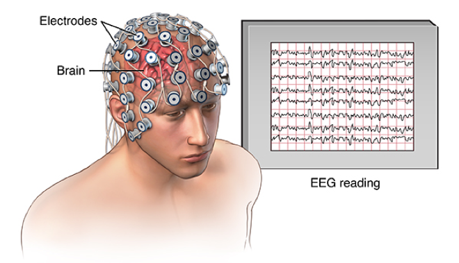
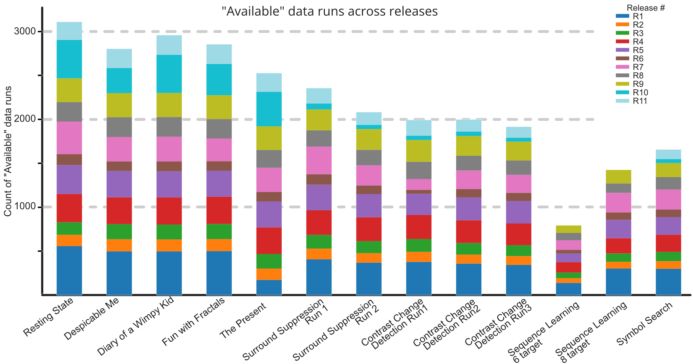
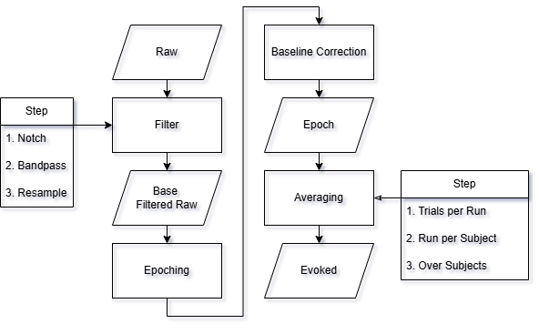
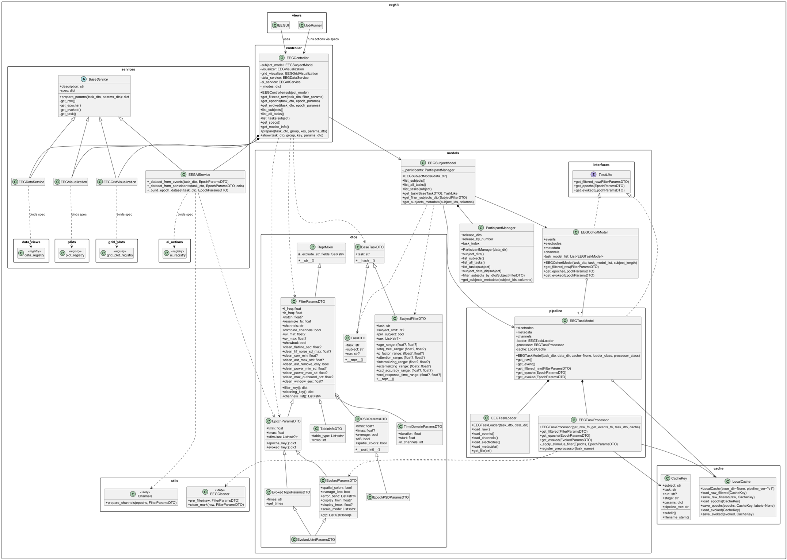

# EEG Analysis Platform for Prestimulus EEG-Based Behavioral Prediction

**Authors:** Nantawat Suksirisunt, Naytitorn Chaovirachot  
**Advisors:** Asst. Prof. Dr. Thanawin Rakthanmanon, Assoc. Prof. Dr. Theerawit Wilaiprasitporn  
**Institution:** Vidyasirimedhi Institute of Science and Technology (VISTEC)  
**Academic Year:** 2565

---

## Brain–Computer Interface (BCI) and Electroencephalography (EEG)

  

<h3>Brain–Computer Interface (BCI)</h3>

A system that enables direct communication between the brain and an external device without relying on peripheral muscles.

Translates neural signals into control commands for interaction or decision-making.

<h3>Electroencephalography (EEG)</h3>

A non-invasive technique for recording electrical activity generated by populations of cortical neurons.

Provides high temporal resolution, making it suitable for analyzing time-locked neural responses to events.

  

  

    
  

---

## Why Reproducible EEG Analysis is Difficult

Many experimental tasks, high subject variability:

**Key Challenge:** As the number of experimental factors increases and subject variability grows, achieving reproducible and generalizable results becomes exponentially more difficult.

---

## Practical Gap in EEG Research

  

Researchers usually choose between:

1. **Commercial tools** - easy to use, but limited and inflexible
2. **Custom scripts** - flexible, but require software engineering skills

**Common outcome in practice:**
- ad-hoc script copies (v1, v2, v3...)
- weak structure and little reuse
- hard-to-maintain and hard-to-reproduce pipelines

**Impact:** slower iteration, lower comparability across experiments, and harder collaboration.

**Question:** How can we provide a structured platform for researchers who can code but are not software engineers?

  

  

    
  

---

## Research Objective

Investigate whether **prestimulus EEG segments** can predict:
1. **Reaction Time (RT)** - Regression target
2. **Trial Correctness** - Binary classification target

**Dataset:** Healthy Brain Network EEG (HBN-EEG)  
**Task:** Contrast Change Detection (CCD)  
**Focus Window:** 2-second inter-trial interval (ITI)

---

## Solution Overview

**EEG Analysis Platform** - A systematic, reproducible analysis framework for domain experts

**Design Philosophy:**
Platform designed for researchers with coding capability but limited software engineering background

**Key Principles:**
- Systematic, reproducible workflows with explicit parameter management
- Modular architecture enabling independent component iteration
- Transparent experiment tracking and artifact caching
- Clear separation between domain logic and infrastructure

**Target Use:**
- Domain experts conducting EEG research
- Researchers needing efficient iteration on preprocessing and modeling
- Teams requiring standardized experimental protocols

**Key Innovation:** Integrate visualization-driven data validation with machine learning experimentation in a unified, parameter-driven interface

---

# SECTION 1: PROJECT INTRODUCTION

---

## Why This Problem Matters

**Reproducibility Crisis in Neuroscience:**

Despite EEG's widespread use, the research community lacks standardized analysis workflows. This creates:

- **Barrier to Reproducibility** - Experiments difficult to replicate or extend
- **Knowledge Fragmentation** - Each research group develops isolated solutions
- **High Cognitive Load** - Researchers must focus on infrastructure rather than science
- **Lost Efficiency** - Repeated development of similar functionality across labs

**The Gap:** Domain experts have domain knowledge but often lack professional software engineering training

**Consequence:** Code becomes difficult to maintain, test, and share—slowing scientific progress

**Our Approach:**
Design a platform that respects domain expertise while providing sound software engineering foundations

---

## Our Solution: EEG Analysis Platform

**Design Objectives:**

1. **Systematic Workflows** - Deterministic, parameter-driven pipelines replacing ad-hoc scripts
2. **Reduced Cognitive Load** - Clear separation between domain logic and infrastructure
3. **Efficient Iteration** - Caching and modular design enabling rapid experimentation
4. **Transparent Reproducibility** - All parameters, seeds, and configurations explicitly logged
5. **Accessibility** - Intuitive interface for researchers with coding skills but limited SE background

**Core Capabilities:**
- Load & explore multi-subject BIDS-formatted EEG data
- Configure reproducible preprocessing pipelines with parameter versioning
- Generate comparison-ready datasets for train model
- Train and evaluate the EEGNet model systematically
- Export standardized results (metrics, plots, configurations)

---

## Our Solution: EEG Analysis Platform

**Success Criteria:**
- Reduced time for experiment setup and iteration
- Increased reproducibility and experiment comparability
- Clear documentation of all processing decisions

---

## Research Foundation: HBN-EEG Dataset

**Healthy Brain Network (HBN) - Multi-Modal Neuroimaging Initiative**

**Dataset Characteristics:**
- Large-scale, open-access dataset with diverse subjects
- Multi-task experimental paradigms with synchronized behavioral measurements
- BIDS-formatted structure enabling standardized analysis workflows
- High-density 128-channel EEG recordings

**Complexity Considerations:**
1. **Subject Heterogeneity** - Diverse demographics, developmental stages, and clinical backgrounds
2. **Multi-Task Design** - Multiple behavioral paradigms enabling diverse research questions
3. **High Dimensionality** - Temporal signals (>500 Hz sampling) across 128 channels = millions of data points per subject
4. **Data Quality Variability** - Artifacts, equipment issues, and subject factors affect signal quality
5. **Release Structure** - Multiple data releases with different processing levels and availability

---

## Research Foundation: Why CCD Task

**Strategic Focus: Contrast Change Detection (CCD) Task**

**Why CCD?**
- **Dual Behavioral Targets:** Captures both accuracy (binary) and reaction time (continuous)
  - Enables validation of preprocessing and feature extraction
  - Provides comparison points across multiple modeling approaches
- **Clear Experimental Structure:** Well-controlled visual stimulus paradigm with unambiguous event markers
- **Sufficient Trial Density:** Adequate trials per subject for robust statistical modeling
- **Generalizability:** Serves as reference workflow applicable to other EEG tasks

**Research Hypothesis:**
Systematic analysis of prestimulus EEG activity during inter-trial intervals can reveal predictive neural signatures of subsequent behavioral performance

---

## System Architecture Overview

  

    
  

  

    <ul>
      <li><strong>Pipeline Pattern:</strong> EEG processing workflow</li>
      <li><strong>Facade Pattern:</strong> API endpoints</li>
      <li><strong>Strategy Pattern:</strong> parameter-driven behavior</li>
      <li><strong>Factory Pattern:</strong> model instantiation</li>
      <li><strong>Registry Pattern:</strong> task preprocessor selection</li>
      <li><strong>Observer Pattern:</strong> WebSocket progress updates</li>
      <li><strong>Repository Pattern:</strong> structured EEG cache</li>
      <li><strong>Composite Pattern:</strong> Pipeline Session is a combination of schemas</li>
    </ul>
  

---

# SECTION 3: SOFTWARE COMPLETION STATUS

---

## Feature Completion Matrix

### COMPLETED

| Feature | Status | Evidence |
|---------|--------|----------|
| **Data loading & discovery** | Complete | UC0 implemented, BIDS loader working |
| **Signal inspection & visualization** | Complete | Plots, topomaps, event tables generated |
| **Preprocessing pipeline** | Complete | Reproducible params stored, cached outputs |
| **Epoch extraction** | Complete | Deterministic trial alignment verified |
| **Dataset building** | Complete | Reusable training datasets created |
| **Model training & evaluation** | Complete | EEGNet trained and evaluated, metrics logged |
| **Experiment logging & reproducibility** | Complete | W&B tracking, config versioning |
| **Backend API (FastAPI)** | Complete | All endpoints functional |
| **Frontend React UI** | Complete | Modular architecture implemented and extensible for new workflows |
| **Job/output storage system** | Complete | Cache, jobs folders organized |

---

## INCOMPLETE / LIMITED

| Feature | Status | Notes |
|---------|--------|-------|
| **WebSocket realtime updates** | Partial | Basic structure; not fully integrated |
| **Model performance** | Needs work | See results section - underfitting & imbalance issues |
| **Hyperparameter automation** | Deferred | Manual tuning done; auto-tuning left |
| **Cross-subject generalization** | Limited | Subject-specific variance high; transfer learning not attempted |
| **Real-time predictions** | Deferred | Backend ready; inference optimization not priority |

---

## What Was Delivered

### Software Artifacts
- **Backend codebase** (app/api, app/pipeline, app/ai_models, app/core, app/plots)
- **Frontend React UI** (modular and extensible structure for future feature growth)
- **Preprocessing pipeline** (BIDS loading, filtering, artifact removal, epoching)
- **Trained AI model (EEGNet)**
- **Experiment tracking** (W&B exports, metrics tables)
- **Reproducible notebooks** (eeg_workbench.ipynb)

### What We Learned
- Preprocessed EEG data is tricky (many failure modes)
- Trial alignment bugs took longest to debug
- Class imbalance causes "accuracy illusion"
- Need validation before model iteration
- Caching intermediate results saves time massively

---

# SECTION 4: RESULTS & EVALUATION

---

## Classification Results

### Prediction Target: Is the trial correct or wrong?

**Test Results Across Balancing Strategies:**

| Strategy | Accuracy | Balanced Acc | Sensitivity | Specificity |
|----------|----------|--------------|-------------|------------|
| **Baseline (no balance)** | 0.729 | 0.501 | **0.993** | 0.009 |
| **Class Weighting** | 0.604 | 0.544 | 0.674 | 0.414 |
| **Weighted Sampler** | 0.629 | 0.543 | 0.729 | 0.358 |
| **Undersampling** | **0.652** | **0.537** | 0.787 | **0.287** |

### Interpretation:
- **Baseline shows "accuracy trap"**: achieves 72.9% by predicting *everything* as negative class
- **Class imbalance is severe** → minority class near-invisible to model
- **Best result**: Undersampling (0.652 acc) but still unstable
- **Problem**: No single strategy achieves robust, generalizable performance

---

## Regression Results

### Prediction Target: What will the reaction of hit target time be?

**Test Results Across Loss Functions:**

| Loss Function | MAE   | RMSE  | R²    | Pearson |
|---------------|-------|-------|-------|---------|
| **MAE** | 0.2876 | 0.3743 | 0.0063 | 0.0840 |
| **MSE** | 0.2883 | 0.3749 | 0.0030 | 0.0562 |
| **Huber** | 0.2874 | **0.3740** | **0.0079** | **0.0903** |

### Interpretation:
- **R² ≈ 0** across all methods → model barely fits data
- **MAE ~0.29** → predictions close to overall mean RT
- **Huber performs marginally better** but still underfits
- **Problem**: Limited signal in prestimulus window OR inadequate feature engineering

---

## What Went Wrong?

### Known Challenges:
1. **High inter-subject variability** - EEG patterns differ across individuals
2. **Limited trial counts per subject** - Small sample size → overfitting risk
3. **Imbalanced correctness labels** - Most trials correct → model bias
4. **Artifact sensitivity** - Some subjects' recordings noisier than others
5. **Limited prestimulus info** - 2-second window before visual stimulus may inherently lack predictive signal

### What We Tried:
- EEGNet model with multiple training/evaluation settings
- Various balancing strategies (class weights, resampling)
- Hyperparameter tuning
- Did NOT achieve robust predictive performance

---

## Testing & Validation Protocol

### What We Did:
1. **Dataset sanity checks** - Trial counts, label distribution, channel integrity
2. **Train/validation/test splits** - Subject-independent (no data leakage)
3. **Cross-validation** - Multiple fold strategies tested
4. **Reproducibility** - Fixed seeds, logged configurations
5. **Error analysis** - Examined failure modes systematically

### Documentation:
- Metrics tables in W&B
- Verification plots (SNR spectra, confusion matrices, prediction scatter plots)
- Experiment logs (preprocessing params, split definitions, model configs)

---

## Lessons Learned

### What Worked Well
- **Pipeline stability** - Preprocessing now deterministic & reproducible
- **Caching system** - Massive speedup when iterating on models
- **Modular architecture** - Easy to swap components
- **Comprehensive logging** - Can reproduce any run exactly

### What Needs Improvement
- **Model generalization** - Current performance insufficient for practical use
- **Feature engineering** - Raw spectral features may need enhancement
- **Subject adaptation** - May need subject-specific models instead of universal
- **Data quality** - Some subjects' data cleaner than others

### Future Work
1. Try transfer learning across subjects
2. Implement subject-specific models
3. Extend feature engineering (time-frequency, connectivity)
4. Use attention mechanisms or graph neural networks
5. Consider ensemble approaches

---

## Overall Project Assessment

| Dimension | Status | Score |
|-----------|--------|-------|
| **Reproducibility** | Achieved | 9/10 |
| **Software Quality** | Good | 8/10 |
| **Usability** | Improved | 7/10 |
| **Predictive Performance** | Limited | 3/10 |
| **Documentation** | Complete | 9/10 |

**Verdict:** 
- **Strong engineering baseline** - Reproducible, well-architected platform
- **Limited AI performance** - Not yet production-ready for predictions
- **Research value** - Platform enables future iterations more efficiently

---

## Key Takeaway

**This project is a success as a research engineering effort:**

- Replaced fragmented notebooks with reproducible pipeline
- Built systematic experimental workflow
- Identified specific failure modes & next steps
- Model performance remains an **open technical problem**

**The platform is now ready for focused AI improvements.**

---

## Questions & Discussion

**Ask us about:**
- Live demonstration details
- Specific model architectures
- How you can extend this for your own research

